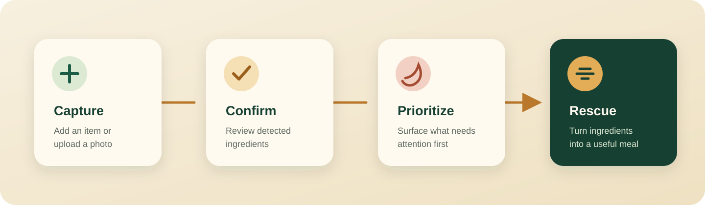
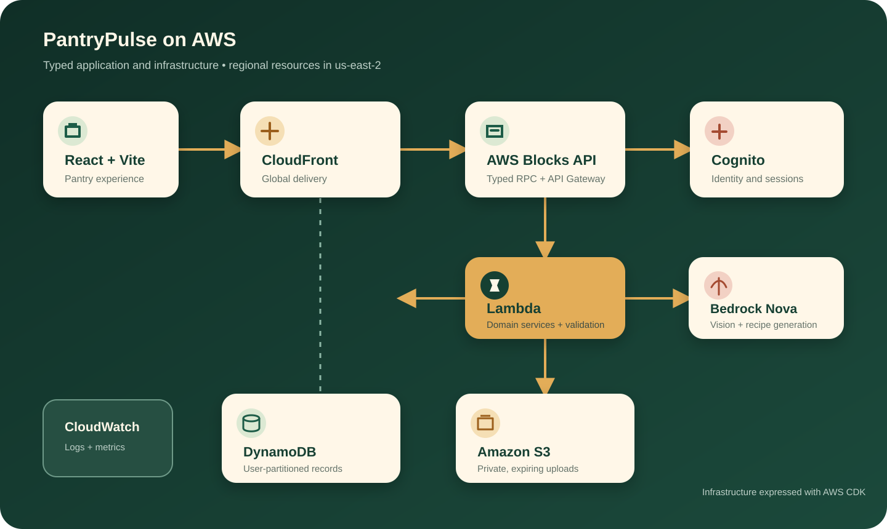

  

<h1 align="center">PantryPulse</h1>

<strong>See what you have. Save what you can. Cook what matters.</strong>

  An AWS full-stack food-rescue concept that turns pantry photos and expiry dates into a clear inventory and practical recipe ideas.

## The idea

Good food is often wasted because it becomes invisible. PantryPulse gives every ingredient a useful next step: capture it, understand its shelf life, and turn it into dinner before it is forgotten.

The experience is built around four small decisions:

- **Capture** groceries manually or from a private pantry photo.
- **Confirm** AI-detected ingredients before they enter the pantry.
- **Prioritize** food by storage location and expiry date.
- **Rescue** ingredients with recipes shaped around time, servings, and dietary preferences.

  

## What makes it PantryPulse

| Capability | Product intent |
| --- | --- |
| Expiry-aware pantry | Keep the most urgent ingredients visible. |
| AI-assisted scanning | Extract structured food candidates from an image while keeping the person in control. |
| Rescue recipes | Combine selected ingredients into realistic recipes with bounded prep time and servings. |
| Reversible outcomes | Record food as consumed or discarded without erasing its history. |
| Personal by design | Derive ownership from the signed-in identity, never from a browser-supplied user ID. |

## Architecture

PantryPulse uses AWS Blocks to express the application and its infrastructure in TypeScript. Regional services are scoped to **us-east-2**; CloudFront is the global delivery layer.

  

The infrastructure definition pairs a React and Vite client with a typed AWS Blocks API. Cognito protects personal routes; the Lambda application partitions DynamoDB records by Cognito subject, keeps scan uploads private in S3, and invokes Amazon Nova through Bedrock for image understanding and recipe generation. CloudWatch receives structured operational logs and product metrics.

## Engineering highlights

- **Identity-bound isolation** — every pantry item, scan, and saved recipe is keyed by the verified Cognito subject.
- **Private image path** — uploads accept only supported image types, enforce a 6 MB analysis limit, and expire after one day.
- **Validated AI output** — Zod schemas constrain scan candidates and recipes before application code accepts them.
- **Conflict-safe updates** — versioned writes reject stale changes instead of silently overwriting newer pantry data.
- **Observable operations** — structured logs and purpose-built metrics cover pantry, scan, and recipe activity.
- **Deterministic local AI** — the same service boundary supports dependable tests without cloud inference.

## Verified behavior

The automated suite covers **29 unit checks** and **10 end-to-end service flows**, including authentication rejection, sign-up and confirmation, pantry CRUD, stale-write conflicts, reversible outcomes, private uploads, scan limits, recipe generation, and cross-user isolation.

## Built with

**React 19 · TypeScript · Vite · AWS Blocks · AWS CDK · Amazon Cognito · AWS Lambda · Amazon API Gateway · Amazon DynamoDB · Amazon S3 · Amazon Bedrock (Nova) · Amazon CloudFront · Amazon CloudWatch · Zod · Vitest**

Designed with a warm, low-waste point of view.

